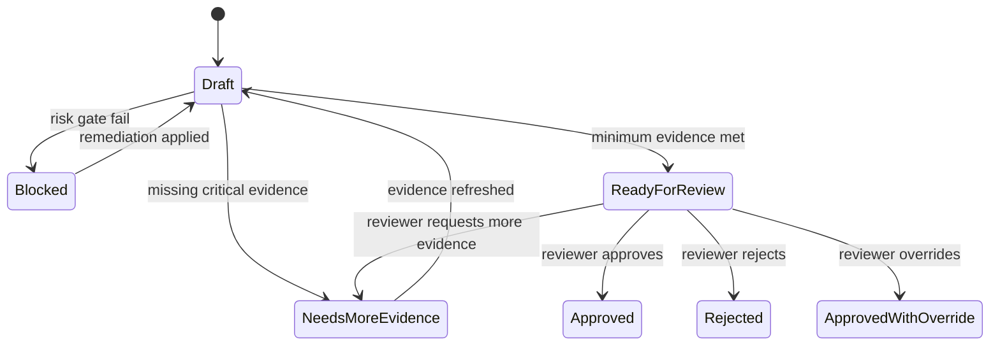
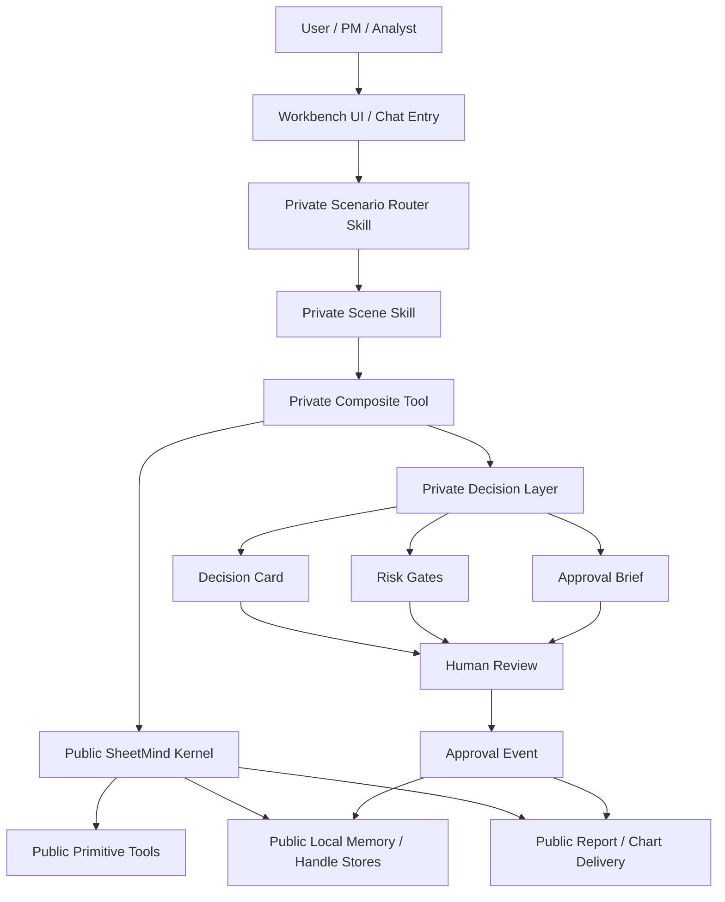

# Scene Package, Decision Layer, and Integration Plan

## Goal

Turn `SheetMind-` into the public foundational kernel of a much larger analysis platform, while keeping scenario-specific intelligence private.

This document delivers three things at once:

1. a standard for private `scene packages`
2. a concrete `Decision Layer` schema and state machine
3. an implementation plan and architecture diagram for the integrated project

---

## 1. Core positioning

The system should be understood as two layers:

- `SheetMind-` = public generic analysis kernel
- `Private Scenario Project` = private upper-layer analysis system built on top of the public kernel

The public layer should remain reusable and open-source.
The private layer should hold the scenario logic, decision logic, and workflow logic that represent real operating edge.

In other words:

- public = engine
- private = doctrine

---

## 2. Scene Package standard

A `scene package` is the smallest private business-analysis unit that is worth maintaining as an internal module.

It should not be a vague agent personality.
It should be a bounded scenario with:

- repeatable inputs
- repeatable evidence requirements
- repeatable judgment criteria
- repeatable outputs
- repeatable approval workflow

### 2.1 What a scene package should represent

Good examples:

- single-name event precheck
- earnings preview and postmortem
- portfolio rebalance review
- macro shock impact brief
- industry chain price transmission analysis
- inventory and pricing pressure analysis
- risk-off regime dashboard

Bad examples:

- general smart analyst
- universal market copilot
- one giant agent that knows all scenes

The goal is modular scene intelligence, not one giant prompt blob.

### 2.2 Standard directory structure

Recommended private repo structure:

```text
private-scenarios/
  Cargo.toml
  src/
    lib.rs
    registry/
      mod.rs
      scene_registry.rs
    scenes/
      equity_event_precheck/
        mod.rs
        scene_contracts.rs
        scene_skill.md
        scene_router.rs
        scene_tools.rs
        scene_decision.rs
        scene_reports.rs
        scene_memory.rs
      earnings_preview/
        mod.rs
        scene_contracts.rs
        scene_skill.md
        scene_router.rs
        scene_tools.rs
        scene_decision.rs
        scene_reports.rs
        scene_memory.rs
    decision/
      mod.rs
      decision_card.rs
      risk_gate.rs
      approval.rs
      confidence.rs
    adapters/
      mod.rs
      market_data.rs
      fundamentals.rs
      events.rs
      portfolio.rs
    binary/
      main.rs
  templates/
    pm_pack/
    risk_review/
    approval_brief/
```

### 2.3 Standard scene package files

Each scene package should contain the following modules.

#### `scene_contracts.rs`

Defines:

- scene input
- scene result
- evidence references
- scenario-specific flags
- scene-local enums

This should be the typed boundary between Skill and Tool behavior.

#### `scene_skill.md`

Defines:

- how to interpret the user request
- which hypotheses to generate
- which composite Tool to call first
- how to explain blocked vs ready states
- how to prepare the approval brief

This is private because it contains the scenario reasoning pattern.

#### `scene_router.rs`

Responsible for:

- deciding whether the request belongs to this scene
- normalizing scene inputs
- selecting the initial composite Tool flow

This is the scene's entrypoint.

#### `scene_tools.rs`

Contains private composite Tools such as:

- `run_scene_precheck`
- `build_scene_evidence_bundle`
- `run_scene_decision_pipeline`

These Tools are private because they encode the exact orchestration of multiple public Tools plus private heuristics.

#### `scene_decision.rs`

Contains:

- scene-specific decision card enrichment
- scene-specific risk gates
- scene-specific approval thresholds
- invalidation rules

This is core proprietary logic.

#### `scene_reports.rs`

Contains:

- scene-specific PM brief generation
- risk review pack generation
- chart layout decisions
- workbook section composition

This is where your output style and operating habit become productized.

#### `scene_memory.rs`

Contains optional private logic for:

- watchlist carry-forward
- approval history lookup
- prior scene outcomes
- postmortem references

This should sit on top of the public local memory system, not replace it.

### 2.4 Standard scene lifecycle

Every scene should follow the same lifecycle:

1. route request into a scene
2. create or update `scene_ref`
3. gather evidence bundle
4. build draft decision card
5. run risk gates
6. prepare approval brief
7. record human outcome
8. emit report and logs

This gives all private scenarios a common operating shape.

### 2.5 Standard scene package interface

Each scene package should implement a trait-like contract.

```rust
pub trait ScenePackage {
    type SceneInput;
    type SceneContext;
    type SceneResult;

    fn scene_name(&self) -> &'static str;
    fn matches(&self, request: &SceneInput) -> bool;
    fn build_context(&self, request: &SceneInput) -> anyhow::Result<Self::SceneContext>;
    fn run(&self, context: &Self::SceneContext) -> anyhow::Result<Self::SceneResult>;
}
```

You do not have to literally use this trait on day one, but the architectural contract should look like this.

---

## 3. Decision Layer schema

The Decision Layer should sit in the private project, but it should reuse the output discipline already visible in `SheetMind-`'s `decision_assistant`.

Its job is to transform scene evidence into a reviewable, auditable object.

### 3.1 Decision Card schema

Recommended base schema:

```json
{
  "decision_id": "dec_20260325_001",
  "scene_name": "equity_event_precheck",
  "asset_id": "NVDA",
  "instrument_type": "equity",
  "strategy_type": "event_driven",
  "horizon": "2w",
  "direction": "long",
  "status": "draft",
  "confidence_score": 0.68,
  "expected_return_range": {
    "low": 0.04,
    "base": 0.08,
    "high": 0.12
  },
  "downside_risk": {
    "soft_stop": -0.03,
    "hard_stop": -0.05,
    "tail_risk_note": "earnings gap risk"
  },
  "position_size_suggestion": {
    "gross_pct": 0.02,
    "max_pct": 0.03,
    "sizing_basis": "event_high_conviction"
  },
  "key_supporting_points": [
    "estimate revision trend improving",
    "price action remains constructive",
    "news flow supportive"
  ],
  "key_risks": [
    "valuation near extreme percentile",
    "earnings event gap risk",
    "semi exposure already elevated"
  ],
  "invalidation_conditions": [
    "guide-down event",
    "sector leadership breakdown",
    "portfolio tech concentration exceeds threshold"
  ],
  "evidence_refs": [
    "dataset_ref:market_snapshot_001",
    "signal_ref:risk_snapshot_001",
    "report_ref:event_summary_001"
  ],
  "portfolio_impact": {
    "sector_exposure_delta": 0.015,
    "factor_exposure_note": "adds growth-beta",
    "liquidity_class": "high"
  },
  "approval": {
    "required": true,
    "approval_state": "pending"
  }
}
```

### 3.2 Decision Card Rust model

```rust
#[derive(Debug, Clone, Serialize, Deserialize)]
pub struct DecisionCard {
    pub decision_id: String,
    pub scene_name: String,
    pub asset_id: String,
    pub instrument_type: String,
    pub strategy_type: String,
    pub horizon: String,
    pub direction: DecisionDirection,
    pub status: DecisionStatus,
    pub confidence_score: f64,
    pub expected_return_range: ExpectedReturnRange,
    pub downside_risk: DownsideRisk,
    pub position_size_suggestion: PositionSizeSuggestion,
    pub key_supporting_points: Vec<String>,
    pub key_risks: Vec<String>,
    pub invalidation_conditions: Vec<String>,
    pub evidence_refs: Vec<String>,
    pub portfolio_impact: PortfolioImpact,
    pub approval: ApprovalState,
}
```

Recommended enums:

- `DecisionDirection`: `Long`, `Short`, `Hedge`, `NoTrade`
- `DecisionStatus`: `Draft`, `NeedsMoreEvidence`, `Blocked`, `ReadyForReview`, `Approved`, `Rejected`, `ApprovedWithOverride`

### 3.3 Risk Gate schema

Risk gates should be explicit objects, not hidden remarks inside a paragraph.

```json
{
  "gate_name": "sector_concentration_gate",
  "result": "fail",
  "blocking": true,
  "reason": "Semiconductor exposure would exceed configured internal concentration limit.",
  "metric_snapshot": {
    "current_sector_exposure": 0.18,
    "post_trade_sector_exposure": 0.22,
    "limit": 0.20
  },
  "remediation": "Reduce suggested size or pair with offsetting reduction in existing semiconductor holdings."
}
```

Rust model:

```rust
#[derive(Debug, Clone, Serialize, Deserialize)]
pub struct RiskGateResult {
    pub gate_name: String,
    pub result: GateResult,
    pub blocking: bool,
    pub reason: String,
    pub metric_snapshot: serde_json::Value,
    pub remediation: Option<String>,
}
```

Recommended `GateResult` values:

- `Pass`
- `Warn`
- `Fail`

### 3.4 Approval Event schema

This is the human confirmation part.

```json
{
  "approval_id": "apr_20260325_009",
  "decision_id": "dec_20260325_001",
  "reviewer": "pm_user_01",
  "action": "approve_with_override",
  "timestamp": "2026-03-25T14:30:00+08:00",
  "notes": "Event setup is compelling enough to override valuation warning.",
  "override_reason": "Expected catalyst strength justifies exception.",
  "decision_version": 3
}
```

Rust model:

```rust
#[derive(Debug, Clone, Serialize, Deserialize)]
pub struct ApprovalEvent {
    pub approval_id: String,
    pub decision_id: String,
    pub reviewer: String,
    pub action: ApprovalAction,
    pub timestamp: String,
    pub notes: Option<String>,
    pub override_reason: Option<String>,
    pub decision_version: u32,
}
```

Recommended approval actions:

- `Approve`
- `Reject`
- `RequestMoreEvidence`
- `ApproveWithOverride`

### 3.5 Decision Layer state machine



This state machine should be hard-coded and auditable.

### 3.6 Recommended first risk gates

Start simple. First version should include:

- `data_freshness_gate`
- `minimum_evidence_gate`
- `event_blackout_gate`
- `liquidity_gate`
- `position_limit_gate`
- `sector_concentration_gate`
- `confidence_gate`

Later you can add:

- `correlation_exposure_gate`
- `portfolio_drawdown_protection_gate`
- `valuation_extreme_gate`
- `macro_regime_gate`

### 3.7 Handle model extension

Build on SheetMind's handle philosophy.

Recommended new refs:

- `dataset_ref`
- `signal_ref`
- `decision_ref`
- `approval_ref`
- `report_ref`
- `watchlist_ref`

These should be persisted similarly to current `table_ref` and `active_handle_ref` logic.

---

## 4. Module diagram

Below is the recommended architecture.



### Interpretation

- the public kernel stays generic
- private scene logic stays above it
- human review is a first-class system step
- report delivery is downstream of approval or review state

---

## 5. Recommended repo and build structure

### 5.1 Public repo

`SheetMind-` should keep:

- runtime
- dispatcher
- generic tool catalog
- generic local memory
- generic export/report system
- generic skill conventions

### 5.2 Private repo

Use a private repo such as:

- `SheetMind-Scenes`
- or `SheetMind-Private`

It should depend on `SheetMind-` as:

- a path dependency during local development
- or a git dependency in stable internal builds

### 5.3 Build strategy

Recommended phase-1 build strategy:

- keep `SheetMind-` building its public binary
- add a separate private binary that links the public crate and private modules

This is better than forcing one binary to contain both open and private logic from day one.

---

## 6. Recommended implementation plan

### Phase 0: Boundary freeze

Goal:

- freeze what belongs to public core vs private layer

Tasks:

- identify public runtime modules that must stay stable
- identify which public contracts private scenarios will rely on
- define a short "public extension contract" document

Output:

- stable public interfaces
- no accidental leakage of scenario logic into public repo

### Phase 1: Introduce finance-neutral Decision Layer primitives

Goal:

- add reusable decision primitives without embedding your proprietary judgment policy yet

Tasks:

- add generic `decision_ref` handle concept
- add generic `DecisionCard` shell to private repo
- add generic `RiskGateResult` and `ApprovalEvent` models
- add persistence for approval events and decision versions

Output:

- typed decision workflow foundation

### Phase 2: Build the first private scene package

Recommended first scene:

- `equity_event_precheck`

Tasks:

- create scene directory structure
- define scene contracts
- write private scene skill
- implement private composite tool
- output draft decision card
- run first 5 to 7 risk gates
- generate approval brief

Output:

- first real end-to-end private scenario

### Phase 3: Report and review flow

Goal:

- make the scene operational for internal use

Tasks:

- adapt report delivery into PM pack
- add risk gate sheet
- add approval log sheet
- support chart generation for scene outputs
- record approval events into memory/log storage

Output:

- usable internal workbench artifact set

### Phase 4: Generalize the scene package contract

Goal:

- turn one working scene into a reusable scene framework

Tasks:

- factor shared scene traits/helpers
- define standard scene result envelope
- define standard scene report sections
- define standard gate and approval display rules

Output:

- reusable private scene framework

### Phase 5: Add more scenes

Add scenes only after phase 2 to 4 work cleanly.

Recommended order:

1. `equity_event_precheck`
2. `earnings_preview`
3. `portfolio_rebalance_review`
4. `macro_shock_brief`

This gives a layered but controlled expansion path.

---

## 7. What to change in the public repo later

Public repo changes should be minimal and extension-oriented.

Recommended future public additions:

- generic handle support for non-table outputs
- generic result envelope contracts
- stable report-draft contract helpers
- optional registry hook points for external/private modules

Do not put these into `SheetMind-` too early:

- private scene routing logic
- finance-specific gate thresholds
- private approval policies
- private scoring heuristics

---

## 8. Practical guidance on "Tool merged into Skill"

From now on, use this terminology internally:

- `primitive tool`: public low-level executable capability
- `composite tool`: private scene-specific executable capability composed from primitive tools
- `skill`: orchestrator and interpreter of tool results

So if you say "merge a Tool into a Skill", the disciplined version should be:

- hide low-level tool complexity behind a private composite tool
- let the scene Skill feel compact and scene-aware
- keep execution and reasoning separable in code

This gives the simplicity you want without wrecking architecture.

---

## 9. Final recommendation

You should treat the future system as:

- one large analysis platform in product terms
- but two layers in code ownership terms

That means:

- `SheetMind-` remains the open engine
- your private repo becomes the upper doctrine layer
- scene packages become the reusable private unit of intelligence
- Decision Layer becomes the private control plane

If done well, this gives you:

- an open-source public reputation layer
- a stable reusable tool kernel
- a private, compounding internal edge

That is the right structure for what you described.
