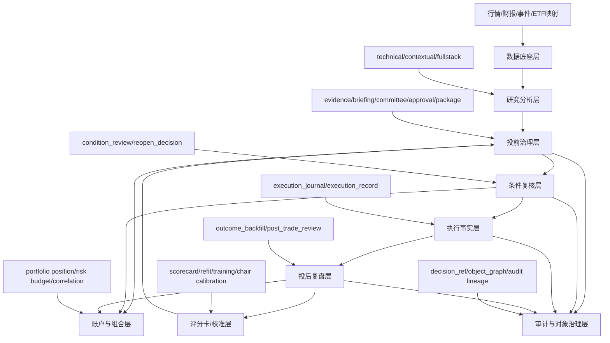

# Security Structure Gap And Condition Review Design

> **For Claude:** REQUIRED SUB-SKILL: Use superpowers:executing-plans to implement this plan task-by-task.

**Goal:** 在当前 Rust 证券主链基础上，明确整个证券分析体系的结构缺口，并把“投中监控中枢”正式改写为无实时数据前提下可落地的“条件复核中枢”。

**Architecture:** 不重开第二套证券决策架构，继续沿用 `security_analysis_* -> decision_evidence_bundle -> committee/committee_vote -> position_plan -> approval/package -> execution_record -> post_trade_review -> scorecard/training/chair` 单主链。新增能力只补中间缺失层，重点是把“投中实时监控”替换成“手动触发 + 收盘批处理 + 事件驱动 + 数据过期驱动”的条件复核层。

**Tech Stack:** Rust、CLI-first、Serde JSON、文件制品落盘、现有 `src/ops/security_*` 对象链、`tests/*_cli.rs` 集成测试、Markdown 交接文档。

---

## 1. 设计背景

当前证券主线已经具备以下核心能力：

- 投前研究与分析：
  - `technical_consultation_basic`
  - `security_analysis_contextual`
  - `security_analysis_fullstack`
- 投前治理与审批：
  - `security_decision_evidence_bundle`
  - `security_decision_briefing`
  - `security_committee_vote`
  - `security_position_plan`
  - `security_decision_submit_approval`
  - `security_decision_package`
  - `security_decision_verify_package`
  - `security_decision_package_revision`
- 投后执行与复盘：
  - `security_execution_journal`
  - `security_execution_record`
  - `security_post_trade_review`
- 量化与主席决议：
  - `security_feature_snapshot`
  - `security_forward_outcome`
  - `security_scorecard`
  - `security_scorecard_refit`
  - `security_scorecard_training`
  - `security_chair_resolution`

这说明系统已经不是“单点分析工具”，而是具备了最小治理闭环。

当前真正的问题不是“功能太少”，而是结构上还缺几块关键骨架：

- 数据底座还不够统一
- 投中层缺正式中枢
- 复盘到校准的闭环还不够强
- ETF / 跨境 ETF 适配层还不完整
- 组合级风险引擎还没有
- 审计与单一事实源还不够硬

其中最需要先澄清的一点是：

**当前没有实时数据，因此不能继续把下一阶段描述成“实时投中监控中枢”。**

如果继续按实时监控设计，会带来两个问题：

1. 设计口径会虚假乐观，后续实现必然打折。
2. 上层用户会误解系统具备盘中秒级响应能力。

因此，本轮设计决定正式改口：

- 不做“实时监控中枢”
- 改做“条件复核中枢”

## 2. 方案选择

### 方案 A：继续沿用“实时投中监控中枢”表述

优点：

- 概念上听起来更完整
- 与传统交易系统术语更接近

缺点：

- 当前没有实时数据，不具备真实基础
- 会把后续实现推向伪实时壳层
- 容易让用户高估系统盘中能力

### 方案 B：改为“条件复核中枢”

优点：

- 与当前数据条件一致
- 能稳定承接手动复核、收盘批处理、事件复核、数据过期复核
- 能和现有 `execution_record / post_trade_review / package_revision` 主链自然衔接

缺点：

- 名字没有“实时监控”那么激进
- 需要把原路线图里“投中监控”的表述整体降级重写

### 方案 C：完全跳过投中层，直接做复盘和评分卡

优点：

- 开发阻力最小
- 可以更快做历史回算

缺点：

- 主链会长期保持“投前强、投后有、投中薄”
- 无法解释“执行过程中为什么要重开投研会/投决会”
- 审计链会缺一整层

**推荐：方案 B。**

## 3. 证券体系结构缺口图

当前建议把证券体系理解为 8 层，而不是若干零散 Tool：



### 3.1 各层当前状态

#### 数据底座层

当前状态：

- 部分存在
- 但没有收成统一证券事实层

结构缺口：

- 行情、财报、事件、ETF 溢折价、汇率、指数映射尚未统一契约
- 不同 Tool 对数据的依赖口径仍偏分散

#### 研究分析层

当前状态：

- 已基本成型

结构缺口：

- ETF / 跨境 ETF 适配不完整
- 数据质量与数据覆盖边界缺乏统一暴露

#### 投前治理层

当前状态：

- 已是现阶段最成熟的一层

结构缺口：

- 历史文档口径仍偶有滞后
- package / verify / revision 的对象图还需要持续冻结

#### 条件复核层

当前状态：

- 结构性缺失

结构缺口：

- 还没有正式 `condition_review` 对象
- 还没有“是否重开投研会/投决会/只更新计划”的中间层

#### 执行事实层

当前状态：

- 已有 `execution_journal` 和 `execution_record`

结构缺口：

- 缺多次复核与多轮执行之间的正式关联
- 缺“执行前提是否仍成立”的挂钩层

#### 投后复盘层

当前状态：

- 已有最小闭环

结构缺口：

- 缺统一结果回填窗口
- 缺除权分红、停牌、ETF 溢折价等特殊口径标准化

#### 评分卡/校准层

当前状态：

- 最小训练主链已通

结构缺口：

- 缺 walk-forward
- 缺 champion/challenger
- 缺委员校准 / 风险闸门校准

#### 账户与组合层

当前状态：

- 已有规则型账户分配

结构缺口：

- 缺组合风险引擎
- 缺波动率/相关性/回撤/情景压力

## 4. 条件复核中枢定义

### 4.1 为什么必须做这一层

当前主链的空洞在于：

- 投前能决策
- 投后能复盘
- 但投中阶段缺少正式的“条件是否仍然成立”判定层

没有这一层，会出现两个问题：

1. `execution_record` 只能记录做了什么，无法解释为什么当时还能继续执行。
2. `post_trade_review` 只能事后评价，无法沉淀投中阶段的分流痕迹。

因此，条件复核中枢的职责不是实时盯盘，而是：

- 在新的外部条件到来时，重新判断原决策是否仍然成立
- 给出结构化后续动作
- 把判断结果挂回 `decision_ref / approval_ref / package_path`

### 4.2 不依赖实时数据的四种触发模式

本轮正式限定条件复核中枢只支持以下 4 种触发：

1. `manual_review`
   - 用户手动提交复核请求
   - 适用于盘中临时观察、主观复核、人工事件输入

2. `end_of_day_review`
   - 收盘后基于最新日线与公告快照批量复核
   - 适用于没有实时行情源的主链默认模式

3. `event_review`
   - 用户或外部任务写入事件事实后触发复核
   - 适用于公告、突发新闻、地缘冲击、分红调整等场景

4. `data_staleness_review`
   - 当研究数据或审批依据过期时触发复核
   - 适用于“不是行情变了，而是证据失效了”的场景

### 4.3 复核中枢的正式输出

建议新增正式对象：

- `security_condition_review`

它的输出至少要回答：

- 当前复核针对哪一份原始决策
- 复核触发原因是什么
- 原有 thesis 是否仍成立
- 原有执行计划是否仍可执行
- 后续动作是什么

后续动作统一收敛为以下几类：

- `keep_plan`
- `update_position_plan`
- `reopen_research`
- `reopen_committee`
- `freeze_execution`

### 4.4 与现有对象的关系

`security_condition_review` 不是替代已有对象，而是夹在中间：

```text
decision/approval/package
    -> condition_review
    -> execution_journal/execution_record
    -> post_trade_review
```

它和现有对象的关系应为：

- 输入来源：
  - `decision_ref`
  - `approval_ref`
  - `position_plan_ref`
  - `package_path`
- 可选输入：
  - 新事件摘要
  - 新价格区间
  - 数据时效状态
- 输出结果：
  - `condition_review_ref`
  - `recommended_follow_up_action`
  - `review_summary`
  - `review_findings`

## 5. 推荐新增对象

### 5.1 `security_condition_review`

职责：

- 记录一次正式投中复核

建议字段：

- `condition_review_id`
- `contract_version`
- `generated_at`
- `symbol`
- `analysis_date`
- `decision_ref`
- `approval_ref`
- `position_plan_ref`
- `package_path`
- `review_trigger_type`
- `review_trigger_summary`
- `data_freshness_status`
- `thesis_status`
- `execution_readiness`
- `recommended_follow_up_action`
- `follow_up_refs`
- `review_findings`
- `review_summary`

### 5.2 `security_execution_journal`

当前已经存在，不建议重造。

本轮设计要求是：

- 继续把它作为执行明细事实层
- 不让它承担“是否该继续执行”的判断职责
- 将来由 `condition_review_ref` 把复核结果和 journal 串起来

### 5.3 `security_signal_outcome_backfill`

建议下一阶段正式补齐。

职责：

- 把统一后验窗口和除权分红口径固化下来

### 5.4 `security_committee_calibration`

建议在条件复核和复盘稳定后再做。

职责：

- 让委员会与风控闸门能从复盘结果中被校准

## 6. 下一阶段实施顺序

本轮给出的正式顺序如下：

### Phase A：条件复核中枢

目标：

- 补齐投中层正式中枢

交付：

- `security_condition_review`
- `condition_review_ref` 与 package / execution / review 挂接

### Phase B：结果回填标准化

目标：

- 统一后验窗口和特殊口径

交付：

- `security_signal_outcome_backfill`
- 分红/除权/ETF 特殊规则

### Phase C：委员会与评分卡校准

目标：

- 让投委会和评分卡从“给判断”升级成“能被纠偏”

交付：

- `security_committee_calibration`
- 风险闸门校准

### Phase D：ETF / 跨境 ETF 适配层

目标：

- 让 ETF 不再被个股模板硬套

交付：

- ETF 专项上下文适配层
- 溢折价/跟踪误差/汇率/指数联动字段

### Phase E：组合级风险引擎

目标：

- 从规则型账户层升级到组合层风控

交付：

- 波动率/相关性/回撤/情景压力

## 7. 为什么不把组合风险引擎放在最前面

因为当前主链最明显的断层不在账户分配，而在“投中阶段没人正式判断原 thesis 是否仍成立”。

如果先做组合风险引擎，会出现：

- 组合层越来越复杂
- 但单笔决策在投中阶段仍然缺复核中枢

这会让系统变成“账户层很聪明，但中间链条仍然断”的状态。

因此顺序上必须先补条件复核层，再补更重的组合级风险层。

## 8. 非目标

本轮设计明确不做：

- 秒级或 tick 级实时监控
- 自动下单
- 券商账户直连
- 伪实时轮询壳层
- 第二套并行证券主链

## 9. 完成定义

满足以下条件即可视为本轮结构设计收口：

1. 证券体系结构缺口已被分层说明，而不是继续按零散 Tool 理解
2. “投中监控中枢”已正式改写为“条件复核中枢”
3. 条件复核中枢的 4 种触发模式已经固定
4. 下一阶段实施顺序已经明确为：
   - 条件复核
   - 结果回填
   - 校准层
   - ETF 适配
   - 组合风险引擎
