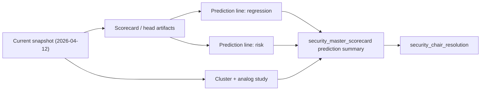

# Future 180D Prediction Mode Design

## Goal

Switch the governed securities stack from "find the latest historical date that can replay 180 days" to "predict the next 180 days from `2026-04-12`", and do so through three explicit lines:

- regression line
- risk line
- clustering / analog line

The output must remain compatible with the formal stack:

- `security_master_scorecard`
- `security_chair_resolution`
- downstream approval / package consumers

## Problem Statement

The current stack is strong at governed replay, but the user's actual requirement is forward-looking:

- start from `2026-04-12`
- predict the coming `180` days
- do not require future realized rows
- expose:
  - expected return
  - expected risk / drawdown
  - regime cluster and analog outcomes

Today the stack still treats `180d` mainly as a replay question. That is why it falls back to historical dates such as `2025-07-11`.

This round must add a prediction path instead of asking replay to behave like prediction.

## Scope

### 1. Add a formal prediction mode

Introduce a governed `prediction_mode` path for securities analysis objects so `180d` can be evaluated without future replay rows.

This mode must:

- preserve current replay behavior for existing callers
- add a forward-looking path for:
  - scorecard training artifacts
  - master scorecard aggregation
  - chair reasoning

### 2. Add 180d return and risk prediction outputs

The prediction package must expose at least:

- expected return over the next 180 days
- expected maximum drawdown or risk loss bound
- expected path quality
- upside-first and stop-first probabilities when available

### 3. Add regime clustering and analog study outputs

The user explicitly wants clustering as a third line, not a hidden diagnostic.

So the prediction package must expose:

- regime cluster label
- cluster rationale
- analog sample count
- analog forward outcome summary

This line can begin with deterministic governed clustering over current feature vectors and existing analog-study utilities, rather than a fully new ML subsystem.

### 4. Surface prediction outputs in balanced scorecard and chair resolution

The final governed output should explain:

- how the regression line looks
- how the risk line looks
- what the current cluster / analog line implies
- why the chair still follows or overrides those signals

## Approach Options

### Option A: Reuse replay objects and only rename the result

Pros:
- smallest change

Cons:
- wrong semantics
- still depends on future rows for long horizons
- would keep confusing historical replay with future prediction

### Option B: Add prediction fields only at the chair layer

Pros:
- faster than a full stack update

Cons:
- leaves scorecard / master scorecard without first-class prediction semantics
- clustering line would become an afterthought

### Option C: Add a first-class prediction mode from head outputs through master scorecard into chair resolution

Pros:
- matches the actual product requirement
- keeps replay and prediction semantics separate
- allows regression / risk / clustering to become explicit governed lines

Cons:
- largest change set

## Recommendation

Choose Option C.

The current issue is not that replay is broken. The issue is that replay is being asked to answer a future-prediction question. The only honest fix is to add a governed prediction mode.

## Architecture

## Proposed Data Model Changes

### Prediction mode flag

Add a governed mode field to the prediction-facing request/result path:

- `replay`
- `prediction`

### Prediction summary object

Add a dedicated summary under `master_scorecard`, for example:

- `prediction_horizon_days`
- `prediction_mode`
- `expected_return_180d`
- `expected_drawdown_180d`
- `expected_path_quality_180d`
- `expected_upside_first_probability_180d`
- `expected_stop_first_probability_180d`
- `regime_cluster_id`
- `regime_cluster_label`
- `analog_sample_count`
- `analog_avg_return_180d`
- `analog_avg_drawdown_180d`

### Chair consumption

Chair reasoning and execution constraints should explicitly mention prediction-mode evidence rather than replay-only language.

## Error Handling

- If prediction models exist but some heads are missing, degrade to partial prediction context, not hard failure.
- If clustering / analog data is insufficient, surface a governed limitation instead of fabricating confidence.
- If both replay and prediction are requested together, prediction must remain a separate output block so the two semantics are never merged.

## Testing Strategy

- RED tests for `security_master_scorecard` prediction-mode outputs
- RED tests for `security_chair_resolution` prediction-mode reasoning
- RED tests for cluster / analog summary presence
- maintain replay tests unchanged to prove backward compatibility

## Risks

- prediction fields could accidentally leak into replay-only consumers if the contract boundary is not explicit
- clustering could be made too magical if it is not tied to governed feature vectors and analog sample counts
- long-horizon prediction confidence can be overstated if we do not preserve model-grade and evidence-depth limits
