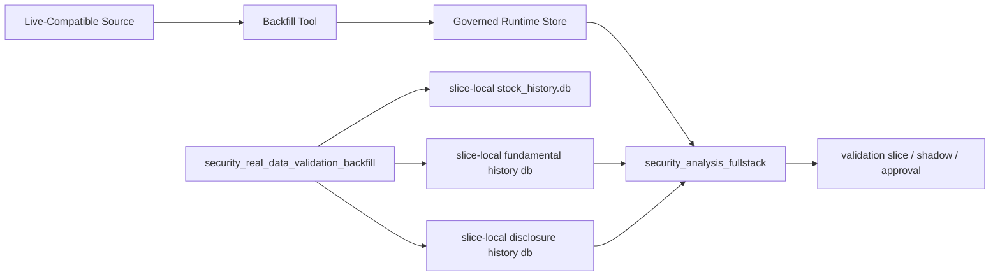

# Historical Data Phase 1 Design

## Goal

Move the securities mainline from price-only validation slices toward governed historical-data validation by adding first-class stock fundamental history and stock disclosure history while reusing the existing ETF external proxy history path.

## Why This Round Exists

The current securities stack is structurally complete enough to analyze, train, govern, approve, and replay decisions. The remaining blocker is data thickness:

- ETF proxy history already has a governed store and tool.
- Stock fundamentals and disclosures still depend on live fetches during each `security_analysis_fullstack` run.
- Validation slices therefore remain only partially reproducible because non-price information is not persisted as governed history.

This round turns those stock information layers into formal runtime history so later validation, shadow, and promotion steps can consume the same persisted evidence.

## Scope

### 1. Reuse ETF external proxy history as-is

No new ETF storage shape is introduced. Existing governed history stays on:

- `security_external_proxy_backfill`
- `security_external_proxy_store`

The round only makes sure validation and later consumers continue to use that governed path.

### 2. Add stock fundamental history

Introduce a runtime store and a formal backfill tool that persist the minimum stock-fundamental contract already used by `security_analysis_fullstack`:

- report period
- notice date
- revenue
- revenue yoy
- net profit
- net profit yoy
- roe
- source / batch / record refs

This avoids inventing a second incompatible financial contract.

### 3. Add stock disclosure history

Introduce a runtime store and a formal backfill tool that persist recent announcement records already consumed by the product:

- published date
- title
- article code
- category
- source / batch / record refs

Aggregation fields such as keyword summary and risk flags stay derived at read time so the storage layer remains simple and durable.

### 4. Make fullstack prefer governed history

`security_analysis_fullstack` should:

1. try to load governed historical fundamentals/disclosures
2. fall back to live fetch only when history is missing

This preserves the current product behavior while making replay deterministic once history exists.

### 5. Persist history inside validation slices

`security_real_data_validation_backfill` should not only refresh prices and persist `fullstack_context.json`. It should also persist the fetched fundamental/disclosure payloads into slice-local governed history stores, so subsequent slice replays read the same non-price evidence.

## Approach Options

### Option A: Only add stock stores and tools

Pros:
- smallest implementation
- leaves current validation tool mostly untouched

Cons:
- validation slices still rely on live fetch at creation time without governing the fetched data
- replay determinism improves only partially

### Option B: Only extend validation slices, no standalone stock history tools

Pros:
- quickest path for validation

Cons:
- stock historical data remains trapped inside validation tooling
- no reusable governed path for future backfill operations

### Option C: Add standalone stock history tools and also wire them into validation slices

Pros:
- creates reusable governed stock history
- keeps validation slices deterministic
- aligns stock history with ETF proxy history governance

Cons:
- larger change set

### Recommendation

Choose Option C. It is the only approach that improves both reusable governance and deterministic validation without building a second data path later.

## Data Flow

## Testing Strategy

- Add CLI catalog + persistence tests for:
  - stock fundamental history backfill
  - stock disclosure history backfill
- Add fullstack tests that prove governed history is used before live fetch.
- Extend validation-slice tests to prove slice-local history stores are written.
- Keep focused regression runs instead of full workspace green until this round settles.

## Risks

- Historical read semantics may drift if “latest by as-of-date” is underspecified.
- Validation slices may become inconsistent if slice-local stock DB and history DBs are not written together.
- Existing live-fetch fallback must remain intact for symbols without governed history.
