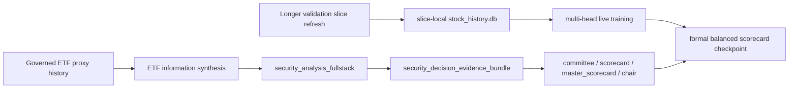

# Balanced Scorecard Data Thickening Design

## Goal

Push the governed securities stack from "multi-head models exist" to "formal conclusions and balanced scorecards can be produced on thicker real data" for both stock and ETF representative assets.

## Why This Round Exists

The current stack is already structurally complete:

- governed price history is available
- governed stock fundamental/disclosure history is available
- governed ETF external proxy history is available
- `direction / return / drawdown / path_quality / upside_first / stop_first` all reach the formal chair layer

But the latest live validation still stops at `abstain` for the ETF batch because the remaining blockers are no longer structural:

1. ETFs still inherit stock-style information expectations, so the final governance layer often reports `needs_more_evidence`
2. current live slices are too short for longer horizons like `180d`
3. the balanced-scorecard path can consume multi-head outputs, but the live-data batch still needs thicker horizon coverage before its conclusions can graduate beyond cautious governance

This round therefore thickens the data and semantics, not just the plumbing.

## Scope

### 1. Add ETF-native information semantics

Stock symbols already have:

- governed fundamental history
- governed disclosure history

ETF symbols do not need those exact contracts, but they still need a governed information layer so the committee and chair can distinguish:

- "ETF has no stock-style financial statements" from
- "ETF still lacks enough ETF-specific research evidence"

This round should add a formal ETF information synthesis path that reads governed ETF proxy history and produces ETF-native information status, headline, rationale, and risk flags.

The synthesized ETF information layer must support at least:

- `treasury_etf`
- `gold_etf`
- `cross_border_etf`
- `equity_etf`

### 2. Extend governed validation slices for longer horizons

The current live ETF slices stop at `2025-08-08`, which leaves only `168` forward rows for `180d` training. That is enough for shorter horizons but not for longer governed heads.

This round should:

- refresh representative validation slices to later end dates
- keep ETF-native market/sector semantics intact
- make the resulting slices usable for longer-horizon governed training and replay

### 3. Re-run multi-head live artifacts on thicker data

After thicker price windows and ETF information semantics exist, this round should re-run the governed multi-head live batch so the formal stack can be checked again on:

- direction
- return
- drawdown
- path quality
- upside first
- stop first

The goal is not to force bullish conclusions. The goal is to make sure the remaining abstentions, if any, come from governed evidence quality rather than missing ETF semantics or thin replay windows.

### 4. Produce a governed balanced-scorecard checkpoint

The final output of this round should be an auditable balanced-scorecard checkpoint that shows:

- which representative assets now have thicker horizon support
- which assets still fail on governance or evidence depth
- which horizons remain unavailable

## Approach Options

### Option A: Only extend price windows

Pros:
- smallest change
- directly addresses `180d`

Cons:
- ETFs still inherit stock-only information expectations
- final chair may continue to downgrade on `needs_more_evidence`

### Option B: Only add ETF information semantics

Pros:
- directly addresses the main ETF governance blocker
- minimal change to the live batch runner

Cons:
- `180d` remains unavailable
- balanced scorecard still lacks longer-horizon replay support

### Option C: Add ETF information semantics and extend live validation windows together

Pros:
- addresses both formal conclusion blockers at once
- keeps the next live batch meaningful
- gives the balanced scorecard a thicker governed basis

Cons:
- larger change set

## Recommendation

Choose Option C.

This is the only approach that moves the product from "the stack can run" to "the stack can issue formal conclusions and balanced scorecards on thicker governed evidence".

## Data Flow

## Testing Strategy

- add RED tests for ETF-native information synthesis inside fullstack
- add RED tests for longer-horizon validation slices that preserve ETF-native profiles
- keep focused live-batch verification against representative stock + ETF assets
- verify final outputs at:
  - `security_master_scorecard`
  - `security_chair_resolution`

## Risks

- ETF information synthesis may become too optimistic if it treats every proxy presence as "evidence complete"
- longer price windows may increase data drift across validation slices if runtime manifests are not refreshed together
- the live batch may still end at `abstain`, which is acceptable as long as the blocker becomes explicit evidence quality rather than missing ETF semantics
